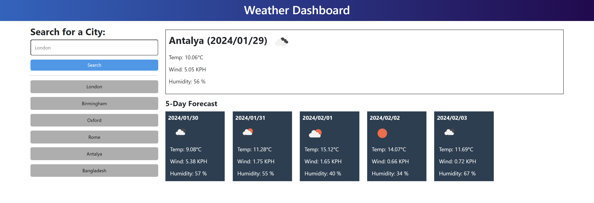

# Meteorology
A dashboard showing weather conditions for specific regions

## Description

A web application that displays weather forecast data for the next five days, along with a feature to view search history.

 You can access the page at https://nukte-y.github.io/Meteorology/

## Usage

**Searching for a City:**

- To search for weather conditions of a city, enter the city name in the provided form input and click the search button.
- The dashboard displays the current weather and future conditions (5-day forecast) for the searched city.
- The searched city is then added to the search history for quick access.

**Viewing Weather Conditions:**

- Upon searching for a city, the dashboard presents the following information about the current weather conditions:
    - City name
    - Date
    - Icon representation of weather conditions
    - Temperature in Celsius
    - Humidity as a percentage
    - Wind speed in kilometers per hour (KMH)

## Credits
N/A

## License
Please refer to the LICENSE in the repo.